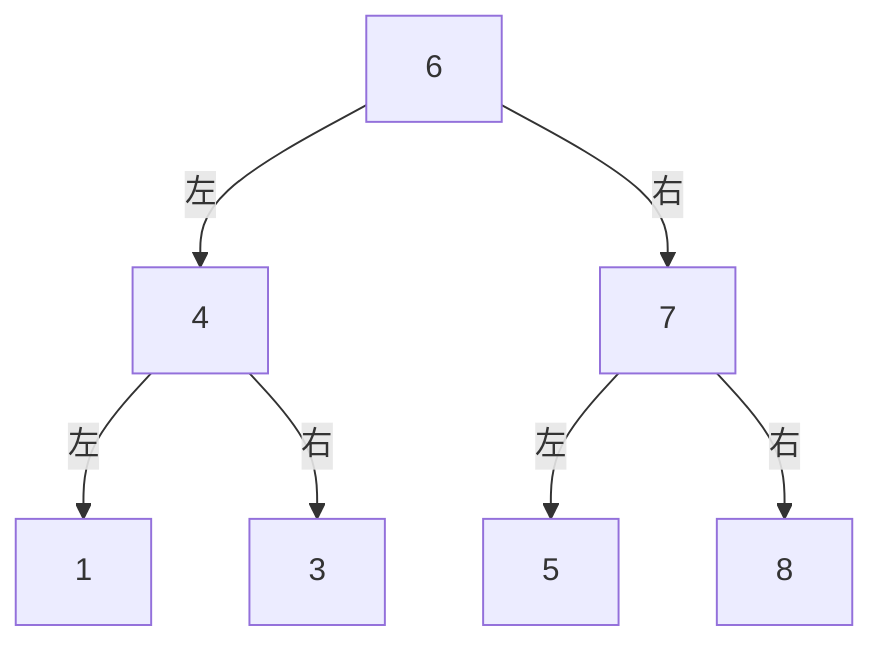

# 哈希表

# 图论和树

树是一种特殊的图

满二叉树
完全二叉树

## 二叉树的遍历

### 前序
**中 -> 左 -> 右**，按顺序遍历
上面的遍历结果: 6 4 1 3 7 5 8
### 中序
**左 -> 中 -> 右**，按顺序遍历
上面的遍历结果: 1 4 3 6 5 7 8
### 后序
**左 -> 右 -> 中**，按顺序遍历
上面的遍历结果: 1 3 4 5 8 7 6

## 深度优先搜索DFS

## 广度优先搜索BFS

